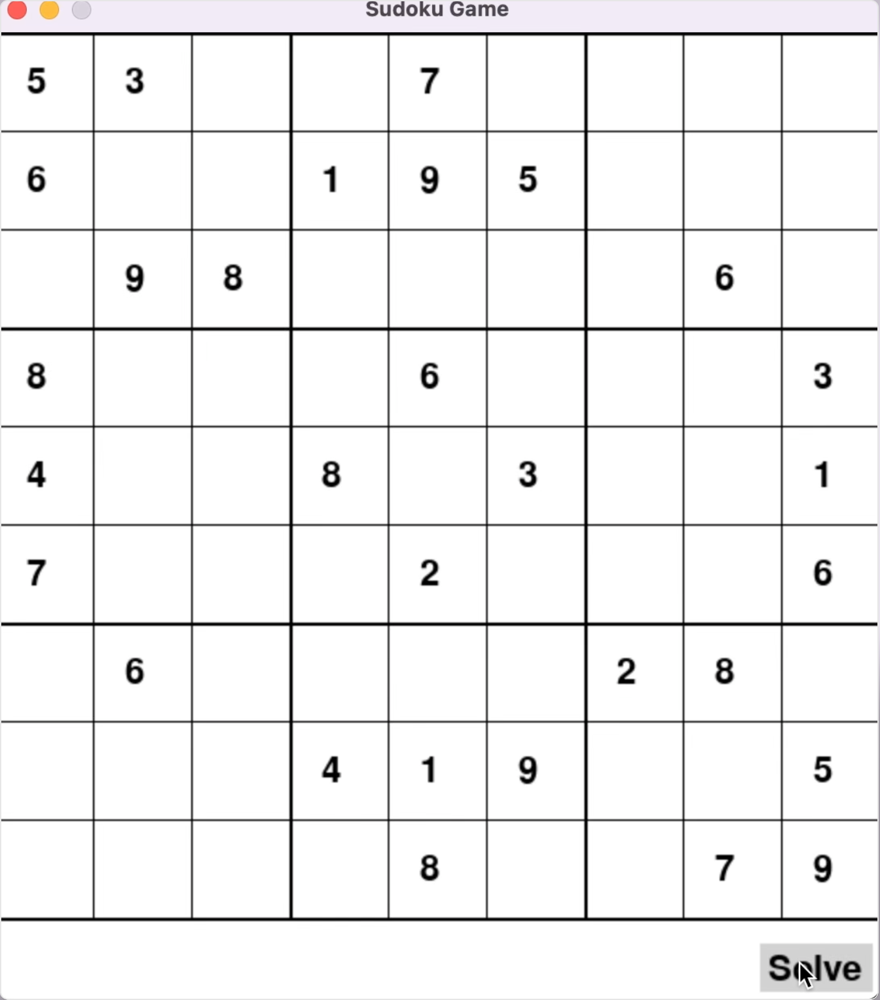

# Sudoku Game
Sudoku is played on a grid of 9 x 9 spaces. Within the rows and columns are 9 “squares” (made up of 3 x 3 spaces). Each row, column and square (9 spaces each) needs to be filled out with the numbers 1-9, without repeating any numbers within the row, column or square.

## BackTracking Algorithm
This Sudoku board was developed using `BackTracking algorithm`, which is a problem-solving algorithmic technique that involves `finding a solution incrementally by trying different options and undoing them if they lead to a dead end`. It is commonly used in situations where you need to explore multiple possibilities to solve a problem, like searching for a path in a maze or solving puzzles like Sudoku. When a dead end is reached, the algorithm backtracks to the previous decision point and explores a different path until a solution is found or all possibilities have been exhausted.

### Demonstration
The algorithm performs almost with the speed of a blink of an eye, when running the `solver.py` script. To enhance the visualization, a graphical user interface (GUI) has been developed `solver.py` (both files on the `src` folder). The GUI provides a clear demonstration of the algorithm's functionality, offering insights into its processes. For a more comprehensive understanding, next is present a video showcasing the GUI in action.

